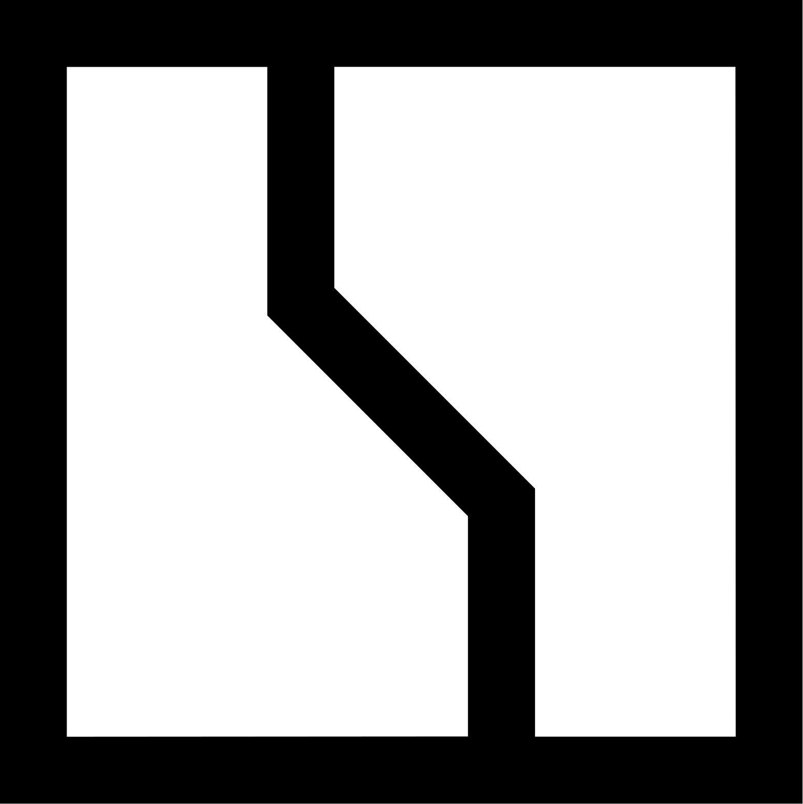

# ioBroker Zeekr Adapter

<p align="center">
  
</p>

This repository contains an ioBroker adapter for Zeekr electric vehicles. It follows the standard ioBroker adapter structure and exposes vehicle state data as datapoints.

## Features

- Standard ioBroker adapter layout with a configuration UI
- Credentials, polling interval, vehicle filter, and debug mode configurable in the ioBroker admin interface
- Vehicle discovery and status polling via a Python bridge that uses the Zeekr API client
- Datapoints for vehicle identity, battery level, range, odometer, charging state, lock state, climate state, and raw payloads
- Health and alert states such as `info.health`, `info.alertCount`, and `info.lastSuccessfulUpdate`
- Automatic bootstrap of a local Python runtime and Zeekr dependency on first use

## Requirements

- Node.js 18+ (20+ recommended)
- Python 3

No manual Python package installation is required. The adapter creates a local virtual environment on first run and installs the Zeekr dependency automatically.

## Development

Run the test suite locally:

```bash
npm test
```

## Installation in a local ioBroker instance

The adapter is designed to be installed directly into an ioBroker host.

Important: the adapter repository is published at `solderer-de/iobroker.zeekr`. For `iobroker url` installs, use a direct tarball URL from `codeload.github.com` rather than a GitHub repository URL or a GitHub release asset URL. The ioBroker CLI treats GitHub repository URLs as Git dependencies and can fall back to SSH-based installs; that is what triggers the `Permission denied (publickey)` failures on this host. A `codeload` tarball URL installs the package as a normal tarball and avoids that Git fallback.

For tarball-based installs, pass the adapter name explicitly as the second argument. `iobroker url <url> zeekr ...` is the reliable form for this adapter. Without the explicit adapter name, the CLI can treat the full URL as the adapter identifier and fail later in the install/upload step even though the npm tarball install itself succeeded.

### Install via CLI (recommended)

Use this exact install form:

```bash
iobroker url https://codeload.github.com/solderer-de/iobroker.zeekr/tar.gz/refs/tags/v0.1.40 zeekr --host iobroker --debug
```

The second argument (`zeekr`) is required for this adapter. This is the concrete install command for the current release.

### Install via ioBroker Admin UI

If you prefer the Admin UI, use the same GitHub release asset URL in the "Adapter from URL install" field. If you upload a file instead, upload the tarball from the release; it must contain the adapter package root with `io-package.json`, `package.json`, `main.js`, `lib/`, `admin/`, and `img/`.

After installation, restart ioBroker and create a new instance of the `Zeekr` adapter.

### Repairing a broken or half-installed adapter

If a previous install left a stale `node_modules/iobroker.zeekr` directory behind, `iobroker del zeekr` can fail with:

```text
Cannot find module 'iobroker.zeekr/io-package.json'
```

In that case, remove the stale module directory from the ioBroker host and reinstall the adapter from the current codeload tarball URL:

```bash
sudo rm -rf /opt/iobroker/node_modules/iobroker.zeekr
sudo iobroker fix
sudo iobroker url https://codeload.github.com/solderer-de/iobroker.zeekr/tar.gz/refs/tags/v0.1.40 zeekr --host iobroker --debug
```

The repository also ships helper scripts for this case:

```bash
./scripts/repair-install.sh
./scripts/install-adapter.sh
```

Both scripts use the same `codeload` tarball URL format and pass the adapter name `zeekr` explicitly for a clean, SSH-free installation path.

### Option B: Install directly from a local checkout

If you want to test the adapter from a local repository checkout, run:

```bash
cd /path/to/iobroker.zeekr
npm ci
```

Then make the adapter visible to ioBroker on a typical Linux host:

```bash
mkdir -p /opt/iobroker/node_modules
ln -s /path/to/iobroker.zeekr /opt/iobroker/node_modules/iobroker.zeekr
```

If you run ioBroker in Docker or a different base path, adapt the target directory accordingly.

### 3. Restart ioBroker

Restart the ioBroker service or container so the adapter is discovered.

### 4. Add an instance in the admin UI

Open the ioBroker Admin UI, create a new instance of the `Zeekr` adapter, and configure:

- username: your Zeekr account email or login name
- password: your Zeekr account password
- polling interval: refresh interval in seconds
- vehicle filter: optional substring filter for one or more vehicles
- debug: enable verbose bridge logging
- pythonBinary: optional override for the Python executable if needed

## Configuration

The adapter exposes the following configuration fields:

- `username`
- `password`
- `pollingInterval`
- `vehicleFilter`
- `pythonBinary` (optional)
- `debug` (boolean)

## Datapoints

The adapter creates a vehicle channel for each discovered vehicle with the following subchannels:

- `status`: battery, range, odometer, charging power, speed, plug state, charging state, lock state, climate state, and timestamps
- `control`: command payload, service ID, send button, last command, and last result
- `raw`: raw payloads from the bridge
- `details`: additional metadata such as model information

The adapter also exposes root states under `info` for connection status, health, errors, logs, and the last successful update.

## Commands

The adapter accepts a lightweight `sendCommand` message with:

- `vin`: target vehicle VIN
- `command`: remote-control command (for example `start` or `stop`, depending on the target action)
- `serviceId`: Zeekr service identifier (for example `RCS` for charge control or other remote-control services)
- `setting`: payload object forwarded to the Zeekr API

The command is routed through the Python bridge and forwarded to the underlying `zeekr_ev_api` client.

## Release and Maintenance

- The repository includes GitHub Actions for CI and release creation.
- Releases are automated with `release-please`; publishing a release triggers the asset build workflow.
- The release workflow builds a tar archive and attaches it to the GitHub release automatically.
- A scheduled upstream sync workflow checks the reference repository for new commits and opens a tracking issue when changes are detected.

## Roadmap

- expose additional datapoints from the Zeekr API
- add controls for charging and climate operations
- improve live validation against a real Zeekr account
